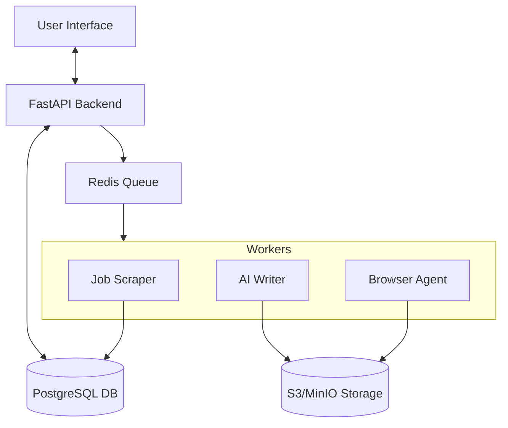

# System Architecture

## High-Level Diagram

## Core Components

### 1. The API (Synchronous)
- **Role:** Handles immediate user requests (Login, Fetch Jobs, Profile Updates).
- **Constraint:** Must respond in <200ms. It *never* runs scraping or AI generation directly.
- **Action:** When a user swipes right, the API pushes a `task_apply_job` message to Redis and returns "202 Accepted" to the UI.

### 2. The Worker Zone (Asynchronous)
- **Role:** Executes time-consuming tasks.
- **Scraper Worker:** Runs periodically (CRON) to fetch new jobs from external sources and populate the DB.
- **Application Worker:** Triggered by a user swipe. It orchestrates the LLM generation and the Playwright automation.

### 3. Storage Strategy
- **Relational Data (PostgreSQL):** Stores User profiles, Job metadata, and Application status (e.g., `pending`, `applied`, `failed`).
- **File Storage (S3/MinIO):** Stores the raw CVs (PDF) and the generated tailored CVs.