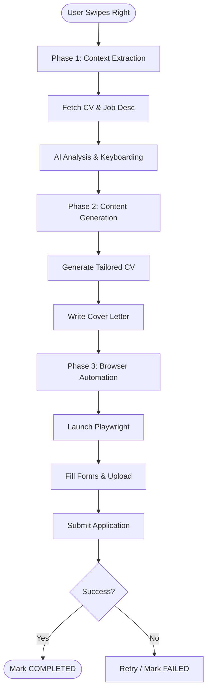

# Automation & AI Workflow

This document details the logic executed by the `Application Worker` when a user swipes right.

## Phase 1: Context Extraction
1. **Fetch Data:** Retrieve User's Base CV (PDF text) and the Job Description.
2. **Analysis (LLM):** - Extract keywords from the Job Description.
   - Map User's experience to these keywords.
   - *Goal:* Determine the "Angle" of the application.

## Phase 2: Content Generation (GenAI)
1. **Tailor CV:** Reword the User's experience to highlight relevant skills. (Output: Markdown/Latex -> converted to PDF).
2. **Write Cover Letter:** Generate a concise, human-tone letter explaining why the user fits this specific role.

## Phase 3: Browser Automation (Playwright)
The agent launches a headless browser context.

### Workflow Logic:
1. **Navigation:** Go to `job.apply_link`.
2. **Form Detection:** Scan the DOM to identify input fields (`name`, `email`, `upload_cv`, `submit`).
3. **Execution:**
   - Fill text inputs using User Profile data.
   - Upload the **Generated PDF** from Phase 2.
   - Handle simple captchas or "I am not a robot" checkboxes (if possible).
4. **Validation:** Click "Submit" and wait for a success indicator (URL change or "Thank You" message).

## Error Handling
- **Retry Policy:** If a selector is not found, retry 3 times with 2s delay.
- **Failure:** If the process fails, mark Application status as `FAILED` and save a screenshot of the error for debugging.