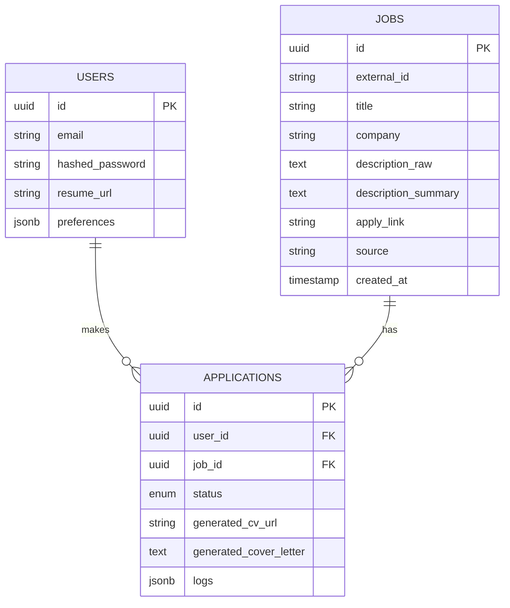

# Database Schema

## 1. Users Table
Stores authentication and profile metadata.
- `id` (UUID, PK)
- `email` (String, Unique)
- `hashed_password` (String)
- `resume_url` (String) - Link to the generic "base" CV.
- `preferences` (JSONB) - { "remote": true, "min_salary": 50000, "locations": [...] }

## 2. Jobs Table
Stores aggregated job offers.
- `id` (UUID, PK)
- `external_id` (String) - Unique ID from the source site.
- `title` (String)
- `company` (String)
- `description_raw` (Text)
- `description_summary` (Text) - AI generated summary for the card view.
- `apply_link` (String)
- `source` (String) - e.g., "LinkedIn", "Indeed".
- `created_at` (Timestamp)

## 3. Applications Table
The link between a User and a Job. Tracks the automation process.
- `id` (UUID, PK)
- `user_id` (FK -> Users)
- `job_id` (FK -> Jobs)
- `status` (Enum) - `QUEUED`, `GENERATING_DOCS`, `APPLYING`, `COMPLETED`, `FAILED`.
- `generated_cv_url` (String) - Link to the specific CV created for this job.
- `generated_cover_letter` (Text)
- `logs` (JSONB) - Stores logs from the agent (e.g., "Field 'Name' filled", "Upload button clicked").